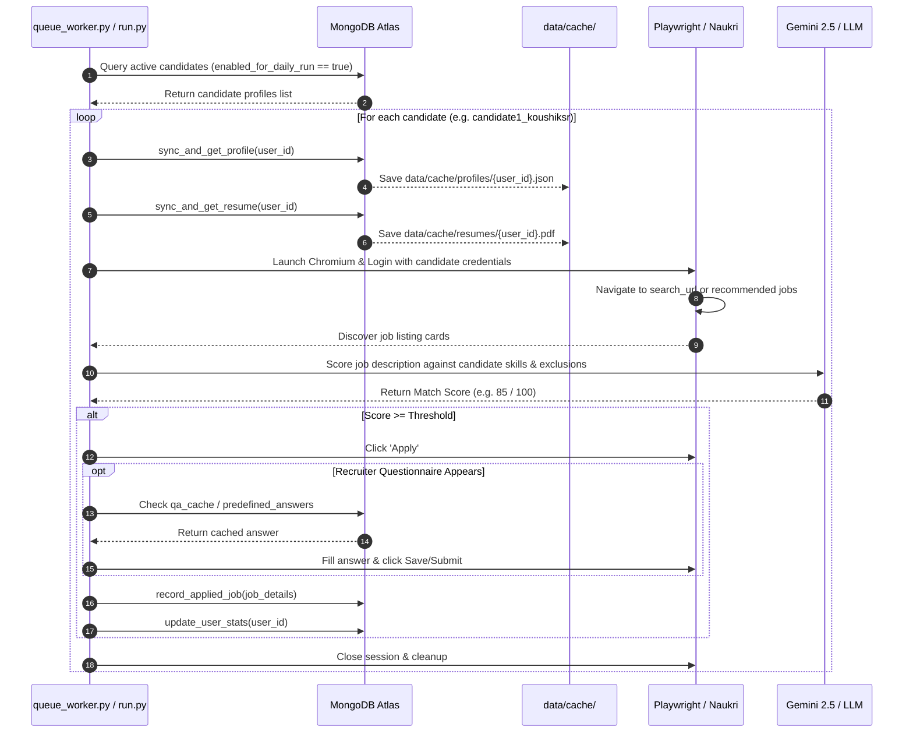
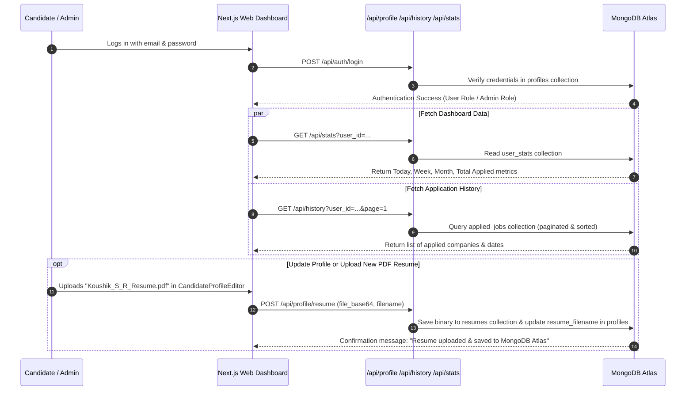

# 🏗️ Naukri AI Automated Job Application System — Architecture & System Design

---

## 🌟 1. System Overview & Core Philosophy

The system is built on a **Decoupled Cloud-Broker Architecture**:
1. **Frontend (Next.js 16 App Router / Vercel)** and **Backend Bot Engine (Python 3.12 / Playwright)** are **100% independent**.
2. **MongoDB Atlas** serves as the **single source of truth** connecting both systems.
3. There are **no direct socket connections, no tunneling daemons, and no fragile inter-process RPCs**.
4. The user manages their profile, credentials, and resume via the Web UI $\rightarrow$ stored in MongoDB Atlas $\rightarrow$ the Python Engine pulls the latest configuration before running $\rightarrow$ applications are submitted on Naukri $\rightarrow$ results & logs are written back to MongoDB Atlas for the user to view in real-time.

```
┌────────────────────────────────────────────────────────┐
│             Candidate Web Dashboard / Admin            │
│         (Next.js 16 + React + Tailwind + Vercel)       │
└───────────────────────────┬────────────────────────────┘
                            │  HTTPS / REST API
                            ▼
┌────────────────────────────────────────────────────────┐
│                   MongoDB Atlas Cloud                  │
│  [profiles]  [resumes]  [applied_jobs]  [user_stats]   │
└───────────────────────────▲────────────────────────────┘
                            │  PyMongo / TLS Connection
                            │  (Pulls profile & saves logs)
┌───────────────────────────┴────────────────────────────┐
│              Python Automated Bot Engine               │
│        (Playwright Headless/Headed + Gemini AI)        │
└───────────────────────────┬────────────────────────────┘
                            │  Automated Browser Flow
                            ▼
┌────────────────────────────────────────────────────────┐
│                   Naukri.com Portal                    │
└────────────────────────────────────────────────────────┘
```

---

## 📂 2. Repository & Directory Structure

### 🐍 Backend Repository: `naukri_ai_bot_automatic_job_apply`

```
naukri_ai_bot_automatic_job_apply/
├── .env                         # MongoDB Atlas URI, Gemini API Key, Settings
├── pyproject.toml               # Python package dependencies & build metadata
├── run.py                       # Main CLI & Scheduled Daemon Entrypoint
│                                #   - `uv run run.py` (Interactive Runner)
│                                #   - `uv run run.py --worker` (Automated 6 AM/8 AM IST Daemon)
├── src/
│   ├── ai_engine.py             # LLM Evaluation (Gemini 2.5) & Job Keyword Scoring
│   ├── core_apply.py            # Playwright Application Automation & Questionnaire Solver
│   ├── core_browser.py          # Browser Context, Stealth Configuration & Naukri Login
│   ├── core_config.py           # Configuration schema, environment loaders & defaults
│   ├── core_jobs_handler.py     # Job Discovery, Filtering, Exclusion & Pagination
│   ├── db.py                    # PyMongo Cloud Data Access Layer & Local Cache Sync
│   ├── main.py                  # Single-candidate batch application pipeline
│   └── queue_worker.py          # Multi-candidate queue scheduler for daily runs
├── data/
│   └── cache/
│       ├── profiles/            # Local cached copies of candidate JSON profiles
│       │   ├── candidate1_koushiksr.json
│       │   └── candidate2_rakshitha_D_L.json
│       ├── resumes/             # Local cached copies of candidate PDF resumes
│       │   ├── candidate1_koushiksr.pdf
│       │   └── candidate2_rakshitha_D_L.pdf
│       └── qa/                  # Local cached recruiter questionnaire answers
│           ├── candidate1_koushiksr_qa.json
│           └── candidate2_rakshitha_D_L_qa.json
└── logs/                        # Application run traces per candidate
    ├── candidate1_koushiksr_bot.log
    └── candidate2_rakshitha_D_L_bot.log
```

---

### 🌐 Frontend Repository: `naukri_ai_bot_automatic_job_apply_frontend`

```
naukri_ai_bot_automatic_job_apply_frontend/
├── .env.local                   # MongoDB Atlas URI (MONGODB_URI)
├── package.json                 # Next.js 16, React 19, Lucide, Framer Motion
├── src/
│   ├── app/
│   │   ├── layout.tsx           # Global HTML shell & Fonts
│   │   ├── globals.css          # Tailwind CSS styles & modern glassmorphism
│   │   ├── page.tsx             # Candidate & Admin Universal Login Portal
│   │   ├── dashboard/
│   │   │   └── page.tsx         # Candidate Dashboard (Metrics, History, Profile)
│   │   ├── admin/
│   │   │   └── page.tsx         # Central Multi-Candidate Admin Hub
│   │   └── api/
│   │       ├── auth/login/      # Candidate & Admin Authentication API
│   │       ├── profile/         # Candidate Profile Read / Deep Update / Delete API
│   │       ├── profile/resume/  # PDF Resume Upload (Base64) & Raw Preview Stream API
│   │       ├── history/         # Searchable & Filtered Applied Jobs History API
│   │       ├── stats/           # Today, Week, Month, and Lifetime Stats API
│   │       └── admin/users/     # Multi-candidate aggregation for Admin Portal
│   ├── components/
│   │   └── CandidateProfileEditor.tsx # Single Shared Reusable Profile Form & JSON Editor
│   └── lib/
│       ├── mongodb.ts           # Cached MongoDB Client Connection Pool
│       └── seedData.ts          # Baseline candidate templates & fallbacks
```

---

## 🗄️ 3. MongoDB Atlas Database Schema

All collections reside under the `ai_job_bot` database in MongoDB Atlas:

### 1. `profiles` Collection
Stores candidate identity, Naukri credentials, skills, filters, and questionnaire answers.
```json
{
  "_id": "ObjectId(...)",
  "user_id": "candidate1_koushiksr",
  "name": "Koushik S R",
  "email": "koushiksr1999@gmail.com",
  "password": "qohcyt-hobsEx-1xirco",
  "experience": 3.0,
  "current_ctc": 800000,
  "expected_ctc": 1600000,
  "search_url": "https://www.naukri.com/python-developer-jobs-in-bangalore-bengaluru",
  "enabled_for_daily_run": true,
  "has_resume": true,
  "resume_filename": "Koushik_S_R_Resume.pdf",
  "resume_size_bytes": 116391,
  "job_filters": {
    "location": ["Bangalore", "Bengaluru", "Remote", "Hybrid"],
    "keywords": ["Python", "FastAPI", "Django", "AI", "LLM", "Full Stack"],
    "must_have_keywords": ["Python"],
    "must_not_have_keywords": ["PHP", "Java", "Angular"],
    "women_only": false,
    "remote_only": false
  },
  "skills": [
    "Python", "FastAPI", "Django", "LLM Integration", "RAG", 
    "LangChain", "PyTorch", "MongoDB", "PostgreSQL", "Docker", "Git", "REST APIs"
  ],
  "predefined_answers": {
    "What is your notice period?": "Immediate / 15 Days",
    "Are you on a career break?": "No",
    "Are you willing to relocate to Bangalore?": "Yes",
    "Are you comfortable working from office / hybrid?": "Yes",
    "What is your current CTC?": "8 LPA",
    "What is your expected CTC?": "16 LPA",
    "Total years of experience in Python": "3"
  },
  "updated_at": "2026-08-25T02:03:00Z",
  "version_hash": "efbeddcb213e1794"
}
```

### 2. `resumes` Collection
Stores raw binary PDF data as Base64 strings for instant preview, cloud backups, and local bot synchronization.
```json
{
  "_id": "ObjectId(...)",
  "user_id": "candidate1_koushiksr",
  "filename": "Koushik_S_R_Resume.pdf",
  "content_type": "application/pdf",
  "file_size_bytes": 116391,
  "file_base64": "JVBERi0xLjUKJ...",
  "extracted_text": "KOUSHIK S R\nAI/ML Engineer...",
  "updated_at": "2026-08-25T02:03:00Z"
}
```

### 3. `applied_jobs` Collection
Stores every job successfully applied to by the bot engine.
```json
{
  "_id": "ObjectId(...)",
  "user_id": "candidate1_koushiksr",
  "job_id": "240826001234",
  "title": "Senior Python AI Developer",
  "company": "Infosys",
  "location": "Bengaluru",
  "url": "https://www.naukri.com/job-listings-240826001234",
  "score": 85,
  "status": "APPLIED",
  "date": "2026-08-25",
  "created_at": "2026-08-25T02:15:30Z"
}
```

### 4. `user_stats` Collection
Aggregated metric counters for instant UI rendering.
```json
{
  "_id": "ObjectId(...)",
  "user_id": "candidate1_koushiksr",
  "today": 14,
  "this_week": 78,
  "this_month": 242,
  "total_applied": 450,
  "last_applied_at": "2026-08-25T02:20:00Z"
}
```

### 5. `qa_cache` Collection
Learned questionnaire answer memory per candidate.
```json
{
  "_id": "ObjectId(...)",
  "user_id": "candidate1_koushiksr",
  "question": "What is your notice period?",
  "answer": "Immediate / 15 Days",
  "question_type": "text",
  "updated_at": "2026-08-25T02:03:00Z"
}
```

---

## ⚙️ 4. Step-by-Step Data & Execution Flow

### 🔄 Flow A: Automated Bot Application Run (Python Backend)



---

### 💻 Flow B: Candidate & Admin Web Management (Next.js Frontend)



---

## 🧩 5. Reusable Component Architecture

The profile form is consolidated into **`src/components/CandidateProfileEditor.tsx`**:
- **Single Source of Truth**: Used in both `/dashboard` and `/admin` modal.
- **Unified Features**:
  1. 👤 **Account Credentials & Login**: Full Name, Naukri Email, Show/Hide Password toggle.
  2. 💼 **Experience & Compensation**: Total Experience, Current CTC (₹), Expected CTC (₹).
  3. 🎯 **Target Skills, Keywords & Locations**: Comma-separated skills, preferred cities, custom Naukri URL.
  4. 💬 **Predefined Questionnaire Answers**: Notice Period, Career Break, Relocation options.
  5. 📄 **Cloud Resume PDF**: Direct upload to MongoDB Atlas, exact filename preservation, 1-click preview.
  6. 📝 **Raw JSON Editor**: Complete document editor with syntax error detection and cloud sync.

---

## 🕒 6. Scheduling & Production Daemon

- **Automated Times**: Runs twice daily at **06:00 AM IST** and **08:00 AM IST**.
- **Daemon Command**:
  ```bash
  uv run run.py --worker
  ```
- **How It Works**:
  1. Wakes up at scheduled intervals.
  2. Queries MongoDB Atlas for all profiles with `enabled_for_daily_run: true`.
  3. Sequentially runs the application engine for each candidate.
  4. Respects maximum daily limits (e.g. 50 jobs per candidate).
  5. Automatically logs out and switches candidate profiles cleanly.
